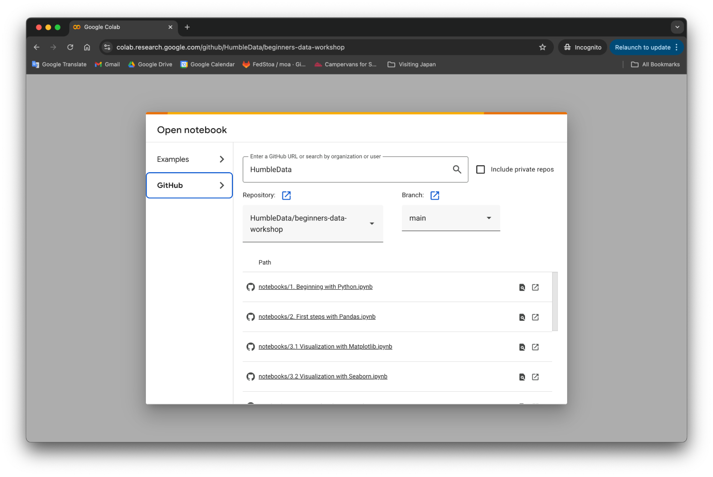
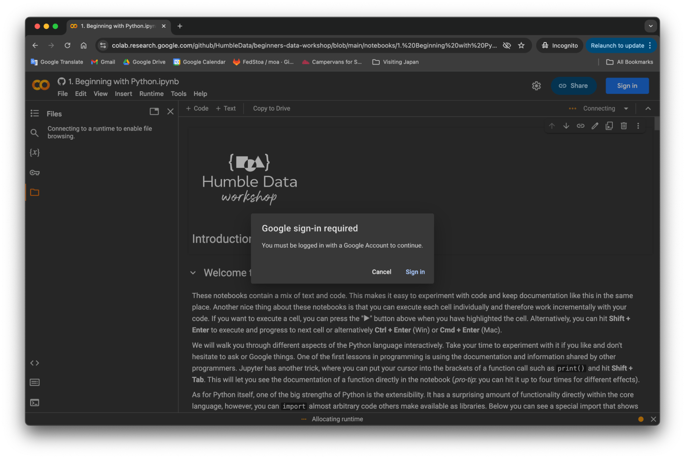
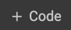
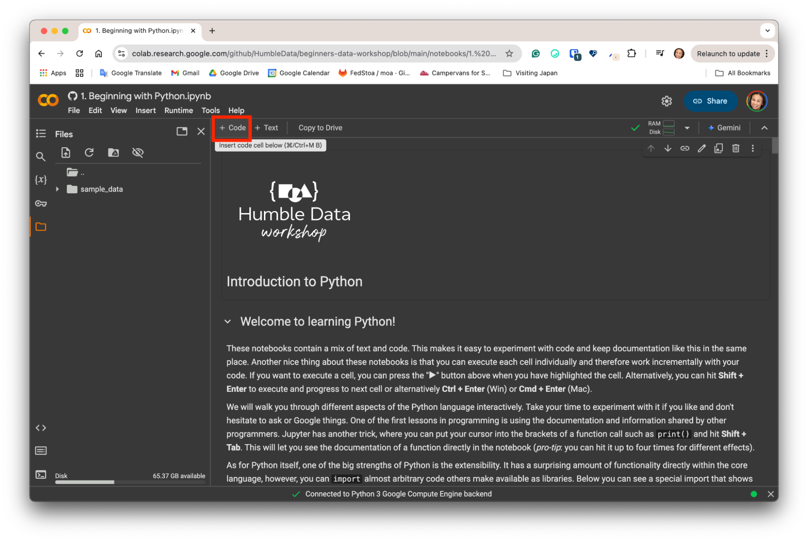
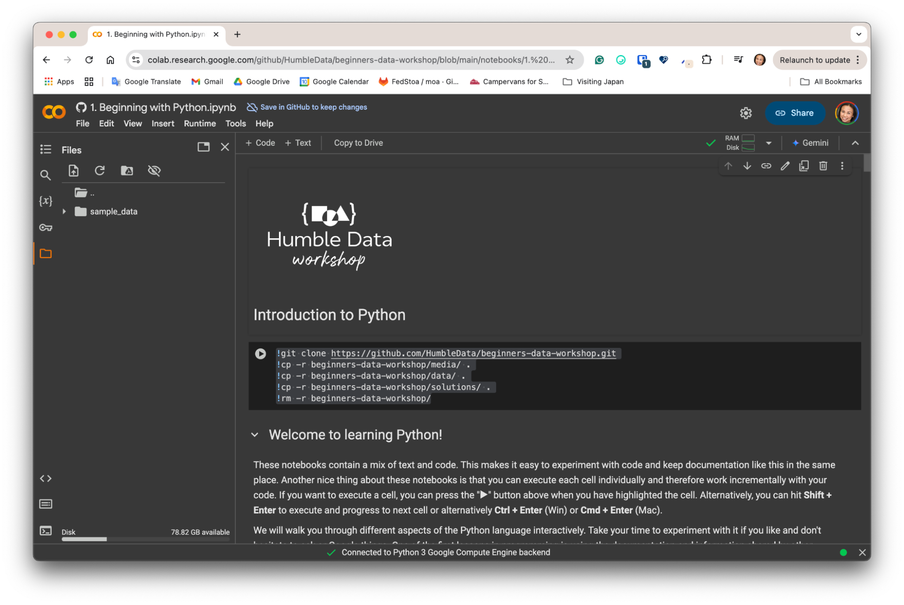
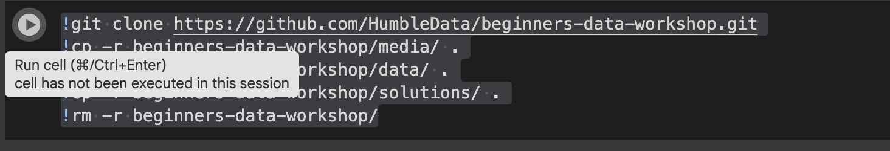
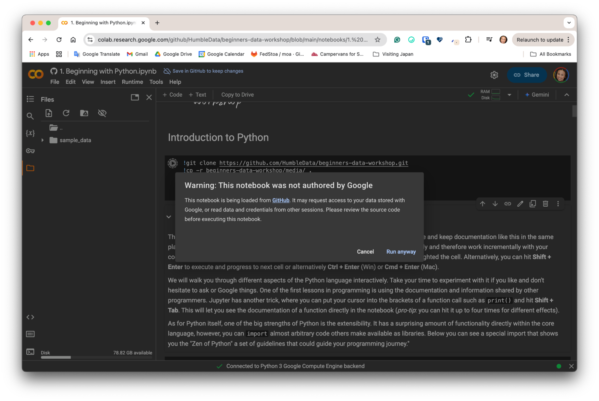
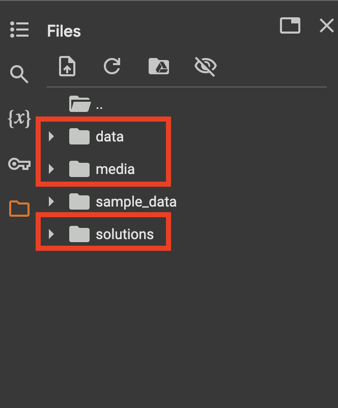
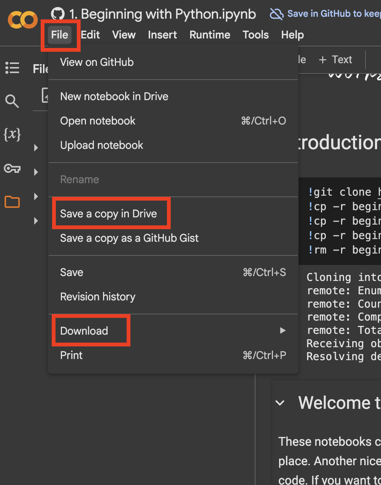

# Humble Data Workshop

[](https://humbledata.org)

## ℹ️ If you would like to know more about this workshop, please [email us](mailto:contact@humbledata.org).

---
## Table of Contents
* [Google Colab setup](#google-colab-setup)
* [Local environment setup](#local-environment-setup)
	+ [UV Installation](#uv-installation)
	+ [Installing Miniconda](#installing-miniconda)
 		- [Windows](#windows)
 		- [Unix (Linux/macOS)](#unix-linuxmacos)
+ [Creating and Activating the Environment](#creating-and-activating-the-environment)

* [License](#license)
---

## Google Colab setup

1. Go to [https://githubtocolab.com/HumbleData/beginners-data-workshop](https://githubtocolab.com/HumbleData/beginners-data-workshop)  
2. Choose the notebook that you want to open  
   
3. Click on the file icon  on the left  
4. If you haven’t logged in to your Google account, you will be asked to do so  
     
5. At the beginning of the notebook, add a cell by clicking the  button at the top  
    
6. After that copy and paste the following codes in the new cell:  
   ``` 
   !git clone https://github.com/HumbleData/beginners-data-workshop.git  
   !cp -r beginners-data-workshop/media/ .  
   !cp -r beginners-data-workshop/data/ .  
   !cp -r beginners-data-workshop/solutions/ .  
   !rm -r beginners-data-workshop/  
   ``` 
   > NOTE: You will need to add this code cell to every notebook you start.

     
7. Run the cell by clicking the play button on the left of the cell or press shift \+ enter on your keyboard  
   
8. You may get this warning when running the first code block. Click “Run anyway” when asked (because you trust us not giving you malicious code).
   
9. When the code is finished (it may take a moment), you should see that three folders are added to your files. Consider the preparation work done and you may now start using the notebook.
   
   
10. Note that when you disconnect from the notebook (or leave it inactive for a long time) the files we just download with the code and your work is not saved.

    Consider downloading or saving your work in drive before you leave this notebook. You can do so by clicking on the “File” button at the bottom.

    

---

## Local environment setup

This document contains instructions on how to run the workshop using either `uv` or `conda` (Miniconda).

### UV Installation
To run this workshop locally using `uv`, first you will need to [install uv](https://docs.astral.sh/uv/getting-started/installation/) on your computer.

Once it is done, follow the instructions below:

1. Create a virtual python virtual environment 3.10+
	* `uv venv humble-data-workshop --python 3.10`
2. Activate the virtual environment.
	* `source humble-data-workshop/bin/activate`
3. Install Dependencies 
	* `uv pip install -r requirements.txt`

### Installing Miniconda

#### Windows
1. Download the Miniconda installer for Windows from the [official website](https://docs.conda.io/en/latest/miniconda.html)
2. Double-click the downloaded `.exe` file
3. Follow the installation prompts:
   - Click "Next"
   - Accept the license terms
   - Select "Just Me" for installation scope
   - Choose an installation directory (default is recommended)
   - In "Advanced Options", check "Add Miniconda3 to my PATH environment variable"
   - Click "Install"

#### Unix (Linux/macOS)
1. Download the Miniconda installer for your system from the [official website](https://docs.conda.io/en/latest/miniconda.html)
2. Open Terminal
3. Navigate to the directory containing the downloaded file
4. Make the installer executable:
   ```bash
   chmod +x Miniconda3-latest-*-x86_64.sh
   ```
5. Run the installer:
   ```bash
   ./Miniconda3-latest-*-x86_64.sh
   ```
6. Follow the prompts:
   - Press Enter to review the license agreement
   - Type "yes" to accept the license terms
   - Confirm the installation location (default is recommended)
   - Type "yes" to initialize Miniconda3

### Creating and Activating the Environment

1. Open a new terminal (Windows: Anaconda Prompt, Unix: Terminal)
2. Create a new environment named 'humble-data':
   ```bash
   conda create -n humble-data python=3.8
   ```
3. Activate the environment:
   - Windows:
     ```bash
     conda activate humble-data
     ```
   - Unix:
     ```bash
     conda activate humble-data
     ```
4. Install required packages:
   ```bash
   pip install -r requirements.txt
   ```

5. Start Jupyter Notebook:
   ```bash
   jupyter notebook
   ```
   This will open Jupyter Notebook in your default web browser. You can now navigate to and open any of the workshop notebooks.

---

## License

<a rel="license" href="http://creativecommons.org/licenses/by-nc-sa/4.0/"></a><br />This work is licensed under a <a rel="license" href="http://creativecommons.org/licenses/by-nc-sa/4.0/">Creative Commons Attribution-NonCommercial-ShareAlike 4.0 International License</a>.
